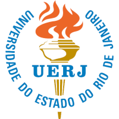

# Agrolocal

Este é o site do Projeto de Extensão de apoio ao pequeno agricultor do Estado do Rio de Janeiro.

O presente projeto de extensão visa aproximar a comunidade acadêmica dos pequenos produtores rurais, agricultores orgânicos, familiares, através de capacitação na área de computação para auxiliá-los na gestão da produção e da comercialização dos seus produtos por meio de cooperativas e associações. Desta forma, o projeto de extensão contribuirá com a edificação da economia solidária, inclusão digital e com o fortalecimento do empreendedorismo rural dos pequenos agricultores do nosso estado.

Este projeto está sendo desenvolvido na Universidade do Estado do Rio de Janeiro e conta com parcerias como Empresa Brasileira de Pesquisa Agropecuária (**Embrapa**) e da Secretaria de Estado de Agricultura, Pecuária, Pesca e Abastecimento (**SEAPPA**) através da Superintendência de Desenvolvimento Rural Sustentável, União das Associações e Cooperativas Usuárias do Pavilhão 30 (**UNACOOP**), Associação de Agricultores Biológicos do Estado do RJ (**ABIO**) entre outras.

